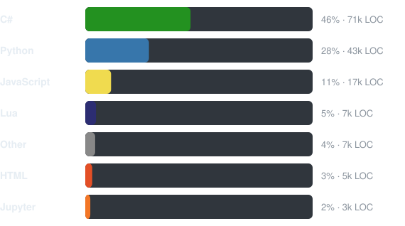

# Ilia Nerovnov - Junior+ Unity Developer

Focused on gameplay systems and architecture. Open to working on pretty much anything.

Resume: [CV.pdf](./CV.pdf) - LinkedIn: [ilia-nerovnov](https://linkedin.com/in/ilia-nerovnov) - Email: ilyanerovnoff@gmail.com

---

## Tech Stack

## Top Languages

